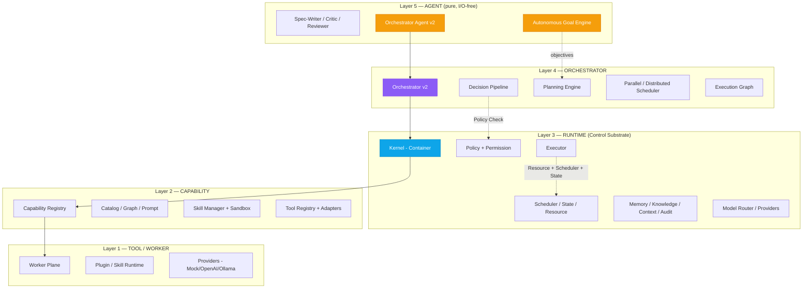
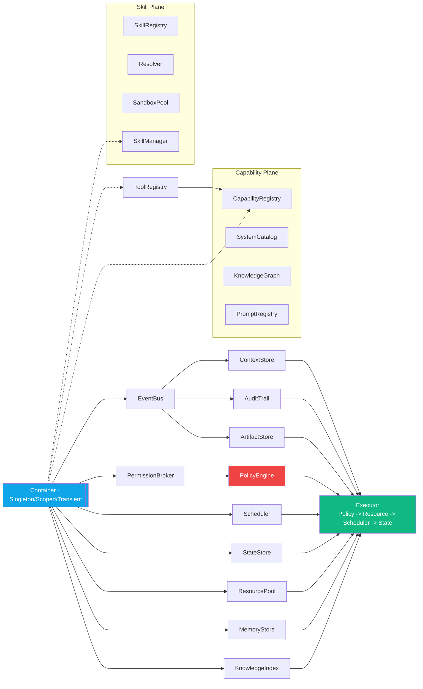
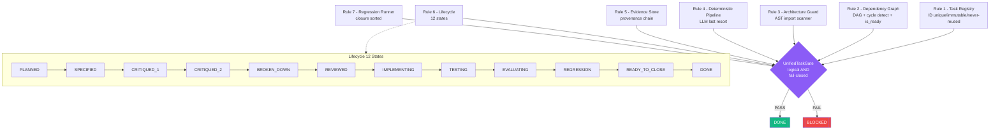
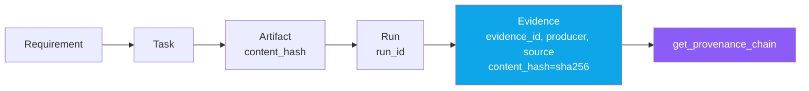
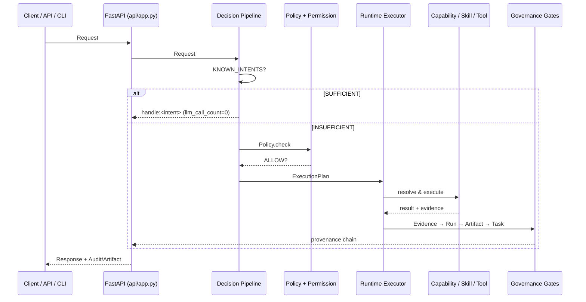
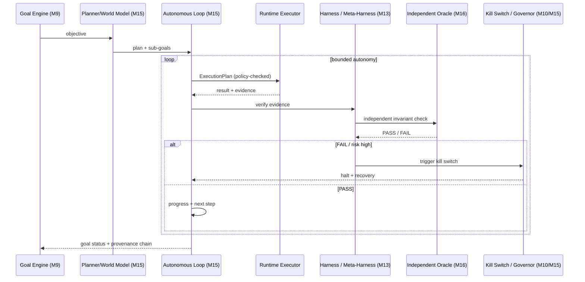

# AIOS — System Architecture Diagrams

> **Runtime-First · Plugin-First · Offline-First · Harness-Verified · Coding-Plane**
>
> Tài liệu này tổng hợp sơ đồ hệ thống AIOS từ `docs/PLAN.md`, `AGENTS.md`,
> `aios/runtime/kernel.py` và `aios/progress/PLAN.md`. Các sơ đồ dùng Mermaid —
> xem trực tiếp trên GitHub hoặc VS Code (cần extension Mermaid).

---

## 1. Phân tầng kiến trúc (Enforced Layering — ARCH-001..004)

Quy tắc import **chỉ đi xuống**, cấm vượt tầng. Guard tại
`aios/governance/architecture/guard.py`. **Trạng thái hiện tại (2026-08-22):**
**TASK-001 → TASK-050 đã DONE** (M0–M9 hoàn tất, 1840 tests xanh).

`Agent → Orchestrator → Runtime → Capability → Tool`

| Rule | Cấm (đối với Agent) |
|------|---------------------|
| ARCH-001 | `subprocess`, `os` execution primitives |
| ARCH-002 | provider adapters (`aios.core.providers`, `aios.runtime.providers`, …) |
| ARCH-003 | filesystem adapters (`aios.runtime.filesystem`, `filesystem`, …) |
| ARCH-004 | upward / skip-layer import (vd: `tool` → `runtime`) |



**Các plane ngang (cross-cutting) hiện có trong `aios/`** — gắn vào Runtime
qua contract, không phá vỡ phân tầng:

| Plane | Packages hiện tại |
|-------|-------------------|
| Governance | `governance/` (7 gates + unified) |
| Core | `core/` (config, container, events, logging, metadata, healthcheck, version, contracts, planner) |
| API / UX | `api/`, `dashboard/`, `cli/`, `extension/` |
| Enterprise | `identity/`, `tenancy/`, `security/`, `quota/`, `ha/`, `operations/` |
| Distributed | `distributed/`, `distributed_scheduler/` |
| Ecosystem | `sdk/`, `plugin_runtime/`, `extension_contracts/`, `ecosystem_registry/`, `ecosystem_hub/`, `devkit/`, `certification/` |
| Autonomy | `autonomous_goal/`, `model_router/`, `memory_coordinator/`, `context_optimizer/` |
| Intelligence | `planning_engine/`, `execution_graph/`, `parallel_scheduler/`, `orchestrator/` |
| Harness / Verify | `harness/`, `ci/` |
| Upgrade / Observability | `upgrade/`, `observability/` |

---

## 2. Runtime Kernel — Composition Root (`aios/runtime/kernel.py`)

`RuntimeKernel` là single composition root: khởi tạo 5 service TASK-004 + 4
service TASK-005, đăng ký vào `Container` để các tầng trên resolve theo type
mà không tight-coupling.



**Wiring order:** `EventBus → Context/Audit/Artifact/Permission → Policy(broker)
→ Scheduler/State/Resource/Memory/Knowledge → Executor`

---

## 3. Governance — 7 Gates → Unified Task Gate

`aios/governance/gates/unified.py`: `UnifiedTaskGate` là logical AND của tất cả
gate; bất kỳ exception → `FAIL` (fail-closed). `DONE` chỉ khi `PASS`.



**Workflow chuẩn (Definition of Done):**
`PLAN → SPEC → CRITIQUE×2 → BREAKDOWN → REVIEW → IMPLEMENT → TEST → EVALUATE
→ REGRESSION → PROGRESS/LOG → COMMIT`

> **Quy tắc 8 — Auto-COMMIT:** mọi TASK đã lên lịch trong
> `docs/AIOS_Master_Task_Specification_M0-M26.md` khi đạt `DONE` (Unified Gate
> `PASS`) phải `COMMIT` source **ngay trong cùng phiên**. Commit message:
> `TASK-xxx: <title> — DONE`.

**Lifecycle artifacts** (`STATE_ARTIFACTS`):

| State | Artifact |
|-------|----------|
| SPECIFIED | `spec.md` |
| CRITIQUED_1 | `critique-1.md` |
| CRITIQUED_2 | `critique-2.md` |
| BROKEN_DOWN | `tasks.md` |
| REVIEWED | `review.md` |
| IMPLEMENTING | `implementation/` |
| TESTING | `test.md` |
| EVALUATING | `evaluation.md` |
| REGRESSION | `regression.md` |

---

## 4. Deterministic-First Execution Pipeline (Rule 4)

`Request → Normalizer → RuleEngine(SUFFICIENT|INSUFFICIENT) → WorkflowMatcher
→ CapabilityResolver → Policy.check → ExecutionPlan`


LLM **không** là default control plane — chỉ fallback khi deterministic
`INSUFFICIENT`, output phải qua `validator(raw)`.

---

## 5. Evidence & Provenance Chain (Rule 5)

`Evidence → Run → Artifact → Task → Requirement`. `UNKNOWN` không được nâng
thành `PASS`.



`Evidence` yêu cầu: `evidence_id, task_id, run_id, producer, type, source,
content_hash=sha256(content)`. `EvidenceStore` giữ 5 registries.

---

## 6. Luồng thực thi End-to-End (API + Deterministic + Governance)



---

## 7. Cấu trúc Monorepo (thực tế — 2026-08-22)

```
aios/
  core/                config, container, events, logging, metadata,
                       healthcheck, version, contracts, planner
  governance/          task_registry/ dependency/ architecture/
                       deterministic/ evidence/ lifecycle/ regression/
                       gates/ cli/
  runtime/             kernel, context, audit, artifact, permission,
                       policy, execution, scheduler, state, resource,
                       memory, knowledge, providers/, workflow/
  orchestrator/        decision_pipeline, planner, normalizer, rule_engine,
                       workflow_matcher, execution_plan, goal_manager,
                       task_queue, failure_recovery, permission_broker
  capability/          capability, catalog, graph, prompt
  skill/               manager, registry, resolver, sandbox
  tool/                adapters, registry, contracts
  worker/              contract, execution, lifecycle, registry, router, workers
  agents/              orchestrator, spec_writer, critic, reviewer
  api/                 app, auth, contracts, deps, errors, events,
                       schemas, websocket, routers/
  cli/                 workflow_cli.py (entry: aiagent)
  dashboard/           client, health, mock_backend, server, views, websocket_client
  autonomous_goal/     engine, contracts
  model_router/        contracts
  memory_coordinator/  contracts
  context_optimizer/   compressor, optimizer, contracts
  planning_engine/     contracts
  execution_graph/     compiler, contracts
  parallel_scheduler/  contracts, scheduler
  distributed/         node_manager, contracts
  distributed_scheduler/ scheduler, contracts
  identity/            (T035)  tenancy/ (T036)  security/ (T070)
  quota/               (T039)  ha/ (T041)  operations/ (T042)
  sdk/                 (T043)  plugin_runtime/ (T044)  extension_contracts/ (T045)
  ecosystem_registry/  (T046)  ecosystem_hub/ (T048)  devkit/ (T047)
  certification/       certifier, contracts (T049)
  harness/             (T029+)  ci/ checker, cli
  upgrade/             (T020)  observability/ (T021)
  progress/            PLAN.md LOG.md STATS.md tasks/<TASK-xxx>/ _TEMPLATE/
configs/               default.yaml development.yaml test.yaml
docs/                  PLAN.md AGENTS.md AIOS_Master_Task_Specification_M0-M26.md detailtask/
```

---

## 8. Trạng thái Task (từ `aios/progress/PLAN.md` — 2026-08-22)

**M0–M9 đã hoàn tất (TASK-001 → TASK-050 đều DONE, 1840 tests).**

| Milestone | Chủ đề | Task range | Status |
|-----------|--------|-----------|--------|
| M0 | Task Governance System | TASK-001 | DONE |
| M1 | Monorepo + Runtime foundations | TASK-002 → 009, 011 | DONE |
| M2 | Orchestration + workers + tools | TASK-010, 012 → 016 | DONE |
| M3 | API + Dashboard + Extension | TASK-017 → 019 | DONE |
| M4 | Upgrade / Observability / Orchestrator v2 | TASK-020 → 022 | DONE |
| M5 | Memory, context, model, planning, execution | TASK-023 → 028 | DONE |
| M6 | Harness Kernel + Verification + Benchmark | TASK-029 → 034 | DONE |
| M7 | Identity, Tenancy, Distributed, HA, Enterprise | TASK-035 → 042 | DONE |
| M8 | SDK, Plugin, Ecosystem, DevKit, Certification | TASK-043 → 049 | DONE |
| M9 | Autonomous Goal Engine | TASK-050 | DONE |

> **Lưu ý fail-closed (audit 2026-08-22):** nhiều package M5–M9 hiện là
> **stub** so với AC đầy đủ trong `docs/detailtask/` (vd: T021, T023–T050).
> Tests xanh với bề mặt stub; spec vẫn là target chuẩn. Xem §13.

> Tiếp theo: **M10 → M26** (xem §10–§12).

---

## 9. CLI & Lệnh chính

```bash
python -m pytest aios -q                          # all gates
python -m pytest aios/governance/architecture -q  # architecture gate only
python aios/governance/cli/gate_check.py --task TASK-001
python aios/governance/cli/parse_spec.py          # registry + dependency validation
aiagent validate  |  aiagent simulate            # workflow CLI (aios/cli/workflow_cli.py)
```

---

## 10. Lộ trình tương lai — Roadmap M10 → M26

Sau M9 (Autonomous Goal), AIOS tiến tới **AIOS 1.0** (M10–M13: đóng băng
architecture/contract, hardening, durable execution, autonomy safety, security
baseline, devX, dashboard 1.0, certification suite) rồi mở rộng sang **Coding
Plane** (M14–M26: verify-the-verifier, autonomous harness, autonomous coding
agents, evidence/risk/quality gates).


**Bản đồ milestone → chủ đề:**

| Milestone | Chủ đề chính | Task tiêu biểu |
|-----------|--------------|----------------|
| M10 | AIOS 1.0 Baseline | T063 Architecture 1.0, T064 Contract Freeze, T065 Runtime Hardening, T066 Durable Execution, T067 Autonomy Safety, T068 Kill Switch, T069 Reliability, T070 Security Baseline, T071 DevX, T072 Dashboard 1.0, T073 Cert Suite, T074 Upgrade/Migration 1.0, T075 Perf/Cost |
| M11 | Verification Integrity + Creative | T078 Fail-Closed Gate, T079 RenderReplay, T080 Visual Evidence, T081 Asset Pipeline, T082 Creative Domain, T083 SkillDistiller |
| M12 | Compatibility 1.1 | T084 Version+Compat Baseline, T085 Migration 1.0→1.1, T086 Backward Compat, T087 Conformance, T088 Docs/ADR |
| M13 | Behavioral Conformance + Meta-Harness | T089 Behavioral Conformance, T090 Harness Coverage, T091 Meta-Harness, T092 System Readiness, T093 Behavioral Spec |
| M14 | Diagnose / Simulate / Autonomous Harness | T094 Detect+Diagnose, T095 Candidate+Risk, T096 Simulation+Meta-Verify, T097 Permission+Human Approval, T098 Remediation+Kill Switch, T099 Autonomous Harness Loop, T100 Failure-Corpus |
| M15 | Autonomous Loop | T051 Planner, T052 World Model, T053 Loop, T054 Governor, T055 Recovery, T056 Long-Horizon, T057 Memory, T058 Experimentation, T059 Multi-Agent, T060 Evaluation, T061 Stuck Detection, T062 Scheduler |
| M16 | Independent Harness + Oracle | T104 Integration Foundation, T105 Verification Oracle |
| M17 | Model Contracts + Provider Lifecycle | T109 Model Contracts, T110 Provider Registry+Lifecycle |
| M18 | Repo Intelligence | T117 Repository Scanner, T118 Source/Symbol Index |
| M19 | Coder Agent | T125 Coder Agent Contract+SM, T126 Coding Planner+PlanVerifier |
| M20 | Execution + Sandbox | T135 Execution Contract, T136 Sandbox Manager |
| M21 | Coding Loop | T145 Coding Loop SM, T146 Execution Observation |
| M22 | Evidence Adequacy | T155 Req→Evidence Mapping, T156 Test Adequacy+Mutation Verifier |
| M23 | Adversarial | T165 Adversarial Eval Harness, T166 Evidence Attackers |
| M24 | Quality + Risk | T175 Quality Gate+States, T176 Risk Model+Classification |
| M25 | Coding Evaluation | T185 Coding Eval Contract, T186 Evaluation Engine |
| M26 | Unified Coding Plane | T197 Unified Coding Contract, T198 Coding SM, T199 Coding Policy Engine |

---

## 11. Kiến trúc mục tiêu — AIOS 1.0 + Coding Plane

```mermaid
flowchart TB
    subgraph EXT["External Surfaces"]
        UX[Dashboard 1.0 / VS Code Ext / Public SDK]
        API[FastAPI REST + WebSocket]
    end
    subgraph GOV["Governance (fail-closed)"]
        UG[Unified Task Gate<br/>7 rules AND]
        HAR[Harness / Meta-Harness<br/>Verify-the-Verifier]
        ORACLE[Independent Verification Oracle<br/>M16]
    end
    subgraph AUTO["Autonomy Plane (M15)"]
        AG[Autonomous Goal Engine]
        PL[Planner + World Model]
        GOV2[Autonomy Governor + Kill Switch]
        LOOP[Autonomous Loop + Recovery]
    end
    subgraph CORE["Core Control Substrate"]
        ORC[Orchestrator v2 + Scheduler + Execution Graph]
        RT[Runtime Kernel + Policy + Permission]
        CAP[Capability / Skill / Tool / Worker]
    end
    subgraph CODE["Coding Plane (M19–M26)"]
        CA[Coder Agent Contract + SM]
        CP[Coding Planner + PlanVerifier]
        CL[Coding Loop SM + Observation]
        CE[Coding Eval + Unified Contract + Policy]
    end
    subgraph ENT["Enterprise / Distributed"]
        ID[Identity/RBAC + Tenancy]
        DIST[Distributed Runtime + Scheduler]
        HA[HA + Audit + Recovery]
        QUOTA[Quota + Cost]
    end
    subgraph ECO["Ecosystem"]
        SDK[Public SDK] REG[Ecosystem Registry] HUB[Ecosystem Hub] CERT[Certification]
    end

    UX --> API --> ORC
    ORC --> RT --> CAP
    AG --> PL --> LOOP --> GOV2
    GOV2 -.->|bounded autonomy| ORC
    CA --> CP --> CL --> CE
    CE -.->|evidence| HAR
    HAR --> UG --> ORACLE
    RT -.-> ENT
    CAP -.-> ECO

    style UG fill:#8b5cf6,color:#fff
    style ORACLE fill:#8b5cf6,color:#fff
    style HAR fill:#0ea5e9,color:#fff
    style GOV2 fill:#ef4444,color:#fff
    style RT fill:#10b981,color:#fff
```

---

## 12. Vòng lặp Tự chủ & Verification Oracle (M15–M16)



---

## 13. Khoảng cách đã biết (honest gaps — fail-closed)

Nhiều package M5–M9 hiện là **stub** so với AC đầy đủ (`docs/detailtask/`),
tests xanh với bề mặt stub. Đây là target của các milestone tương lai, không
được downgrade thầm:

| Task | Gap chính |
|------|-----------|
| T021 Observability | thiếu Health API / Dashboard-integration chuyên biệt |
| T023 Memory Coordinator | thiếu `filters`/`ranking_policy`/`provenance`/`checksum` |
| T024 Context Optimizer | gộp sub-component, non-ASCII id `P5参考资料` |
| T025 Model Router | thiếu `FallbackResolver`/fallback chain |
| T028 Parallel Scheduler | `JoinPolicy` chỉ `ALL_SUCCESS` |
| T029–T034 Harness | thiếu Registry/Replay/Evaluators/Doctor modules + CLI |
| T035–T042 Enterprise | thiếu ABAC/Tenant boundary/HA audit/Operations endpoints |
| T043–T050 Ecosystem | thiếu TS SDK/Plugin isolation/Cert profiles/Goal SM |

> Nguyên tắc **fail-closed**: UNKNOWN không được nâng thành PASS; spec luôn là
> canonical target. Các gap này sẽ được lấp dần qua M10–M26 (đặc biệt M10
> hardening, M13 meta-harness, M22–M24 evidence/quality gates).

*Tài liệu được sinh tự động từ source tree AIOS — cập nhật khi có milestone mới.*
