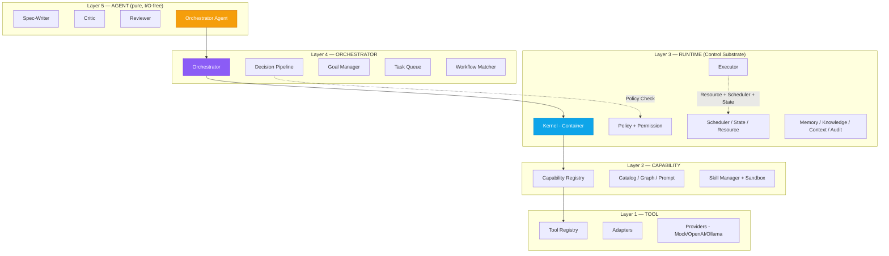
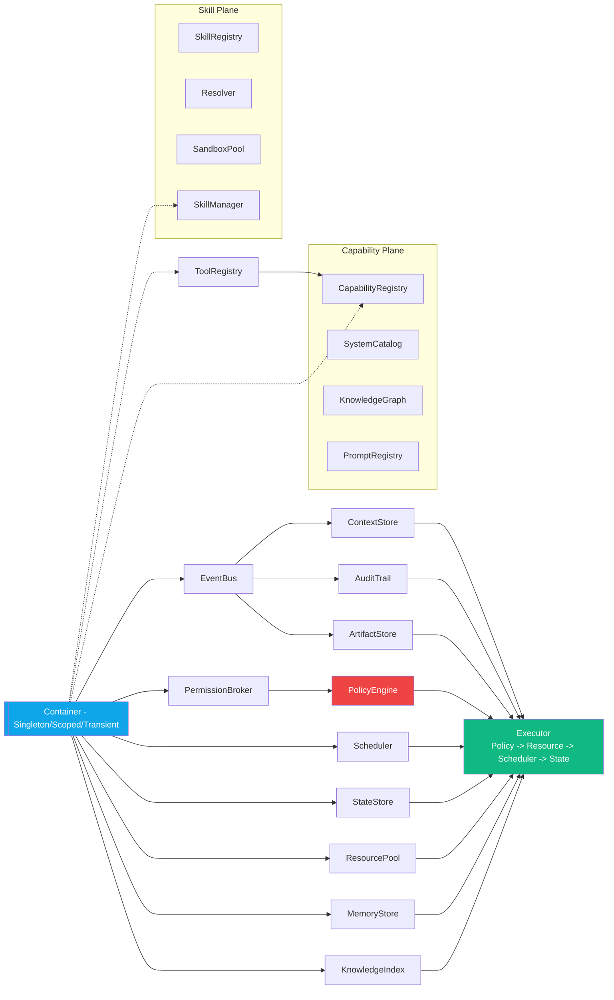
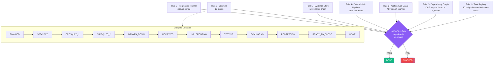
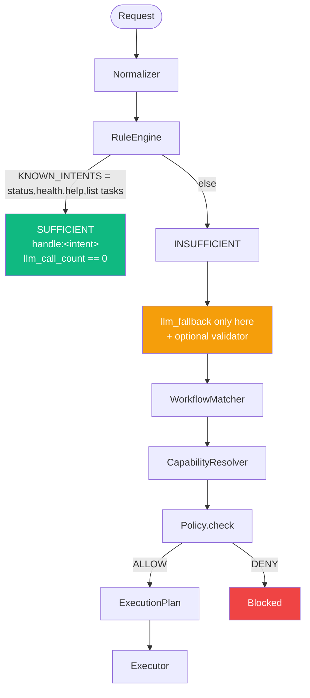
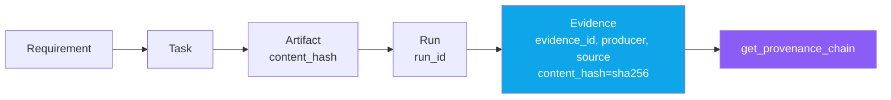
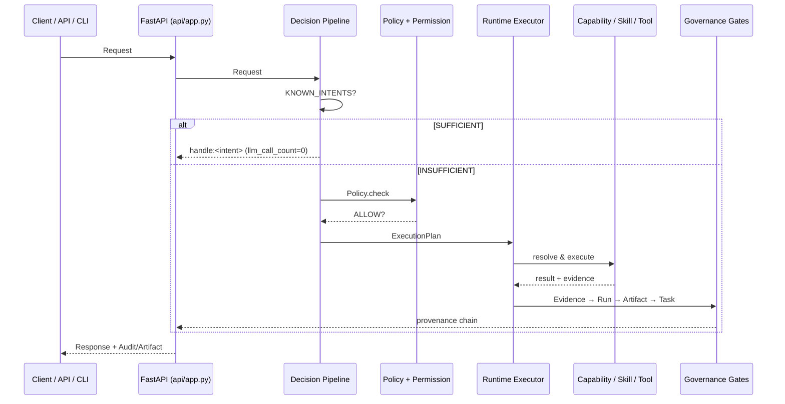

# AIOS — System Architecture Diagrams

> **Runtime-First · Plugin-First · Offline-First · Harness-Verified · Coding-Plane**
>
> Tài liệu này tổng hợp sơ đồ hệ thống AIOS từ `docs/PLAN.md`, `AGENTS.md`,
> `aios/runtime/kernel.py` và `aios/progress/PLAN.md`. Các sơ đồ dùng Mermaid —
> xem trực tiếp trên GitHub hoặc VS Code (cần extension Mermaid).

---

## 1. Phân tầng kiến trúc (Enforced Layering — ARCH-001..004)

Quy tắc import **chỉ đi xuống**, cấm vượt tầng. Guard tại
`aios/governance/architecture/guard.py`.

`Agent → Orchestrator → Runtime → Capability → Tool`

| Rule | Cấm (đối với Agent) |
|------|---------------------|
| ARCH-001 | `subprocess`, `os` execution primitives |
| ARCH-002 | provider adapters (`aios.core.providers`, `aios.runtime.providers`, …) |
| ARCH-003 | filesystem adapters (`aios.runtime.filesystem`, `filesystem`, …) |
| ARCH-004 | upward / skip-layer import (vd: `tool` → `runtime`) |



---

## 2. Runtime Kernel — Composition Root (`aios/runtime/kernel.py`)

`RuntimeKernel` là single composition root: khởi tạo 5 service TASK-004 + 4
service TASK-005, đăng ký vào `Container` để các tầng trên resolve theo type
mà không tight-coupling.



**Wiring order:** `EventBus → Context/Audit/Artifact/Permission → Policy(broker)
→ Scheduler/State/Resource/Memory/Knowledge → Executor`

---

## 3. Governance — 7 Gates → Unified Task Gate

`aios/governance/gates/unified.py`: `UnifiedTaskGate` là logical AND của tất cả
gate; bất kỳ exception → `FAIL` (fail-closed). `DONE` chỉ khi `PASS`.



**Workflow chuẩn (Definition of Done):**
`PLAN → SPEC → CRITIQUE×2 → BREAKDOWN → REVIEW → IMPLEMENT → TEST → EVALUATE
→ REGRESSION → PROGRESS/LOG → COMMIT`

> **Quy tắc 8 — Auto-COMMIT:** mọi TASK đã lên lịch trong
> `docs/AIOS_Master_Task_Specification_M0-M26.md` khi đạt `DONE` (Unified Gate
> `PASS`) phải `COMMIT` source **ngay trong cùng phiên**. Commit message:
> `TASK-xxx: <title> — DONE`.

**Lifecycle artifacts** (`STATE_ARTIFACTS`):

| State | Artifact |
|-------|----------|
| SPECIFIED | `spec.md` |
| CRITIQUED_1 | `critique-1.md` |
| CRITIQUED_2 | `critique-2.md` |
| BROKEN_DOWN | `tasks.md` |
| REVIEWED | `review.md` |
| IMPLEMENTING | `implementation/` |
| TESTING | `test.md` |
| EVALUATING | `evaluation.md` |
| REGRESSION | `regression.md` |

---

## 4. Deterministic-First Execution Pipeline (Rule 4)

`Request → Normalizer → RuleEngine(SUFFICIENT|INSUFFICIENT) → WorkflowMatcher
→ CapabilityResolver → Policy.check → ExecutionPlan`



LLM **không** là default control plane — chỉ fallback khi deterministic
`INSUFFICIENT`, output phải qua `validator(raw)`.

---

## 5. Evidence & Provenance Chain (Rule 5)

`Evidence → Run → Artifact → Task → Requirement`. `UNKNOWN` không được nâng
thành `PASS`.



`Evidence` yêu cầu: `evidence_id, task_id, run_id, producer, type, source,
content_hash=sha256(content)`. `EvidenceStore` giữ 5 registries.

---

## 6. Luồng thực thi End-to-End (API + Deterministic + Governance)



---

## 7. Cấu trúc Monorepo

```
aios/
  core/          config, container, events, logging, metadata,
                 healthcheck, version, contracts, planner
  governance/    task_registry/ dependency/ architecture/
                 deterministic/ evidence/ lifecycle/ regression/
                 gates/ cli/
  runtime/       kernel, context, audit, artifact, permission,
                 policy, execution, scheduler, state, resource,
                 memory, knowledge, providers/, workflow/
  orchestrator/  decision_pipeline, planner, normalizer, rule_engine,
                 workflow_matcher, execution_plan, goal_manager,
                 task_queue, failure_recovery, permission_broker
  capability/    capability, catalog, graph, prompt
  skill/         manager, registry, resolver, sandbox
  tool/          adapters, registry, contracts
  worker/        contract, execution, lifecycle, registry, router, workers
  agents/        orchestrator, spec_writer, critic, reviewer
  api/           app, auth, contracts, deps, errors, events,
                 schemas, websocket, routers/
  cli/           workflow_cli.py (entry: aiagent)
  harness/       placeholder (M6)
  progress/      PLAN.md LOG.md STATS.md tasks/<TASK-xxx>/ _TEMPLATE/
configs/         default.yaml development.yaml test.yaml
docs/            PLAN.md AGENTS.md AIOS_Master_Task_Specification_M0-M26.md detailtask/
```

---

## 8. Trạng thái Task (từ `aios/progress/PLAN.md`)

| Task | Milestone | Title | Dependencies | Status |
|------|-----------|-------|--------------|--------|
| TASK-001 | M0 | Task Governance System | — | DONE |
| TASK-002 | M1 | Monorepo + aios_core Scaffold | TASK-001 | DONE |
| TASK-003 | M1 | Kernel Foundations | TASK-002 | DONE |
| TASK-004 | M1 | Runtime Services I | TASK-003 | DONE |
| TASK-005 | M1 | Runtime Services II | TASK-004 | DONE |
| TASK-006 | M1 | Model Contract + Provider Registry | TASK-004,TASK-005 | DONE |
| TASK-007 | M1 | Memory + Knowledge | TASK-003 | DONE |
| TASK-008 | M1 | Workflow Definition + Compiler | TASK-003 | DONE |
| TASK-009 | M1 | Capability Foundation | TASK-003 | DONE |
| TASK-011 | M1 | M1 Remediation / Architecture Hardening | TASK-005,TASK-009 | DONE |
| TASK-010 | M2 | Decision Pipeline | TASK-011 | DONE |
| TASK-012 | M2 | Operational Orchestration | TASK-010 | DONE |
| TASK-013 | M2 | Worker Plane | TASK-010,TASK-012 | DONE |
| TASK-014 | M2 | Tool + Capability Layer | TASK-010,TASK-012,TASK-013 | DONE |
| TASK-015 | M2 | Plugin / Skill Execution | TASK-014 | DONE |
| TASK-016 | M2 | Architecture Hardening | TASK-010,TASK-012,TASK-013,TASK-014,TASK-015 | DONE |

> M2 complete. Next: M3 tasks (`READY` per master spec).

---

## 9. CLI & Lệnh chính

```bash
python -m pytest aios -q                          # all gates
python -m pytest aios/governance/architecture -q  # architecture gate only
python aios/governance/cli/gate_check.py --task TASK-001
python aios/governance/cli/parse_spec.py          # registry + dependency validation
aiagent validate  |  aiagent simulate            # workflow CLI (aios/cli/workflow_cli.py)
```

---

*Tài liệu được sinh tự động từ source tree AIOS — cập nhật khi có milestone mới.*
