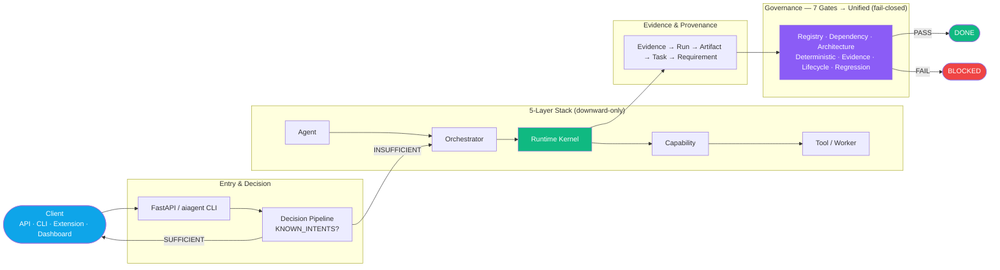
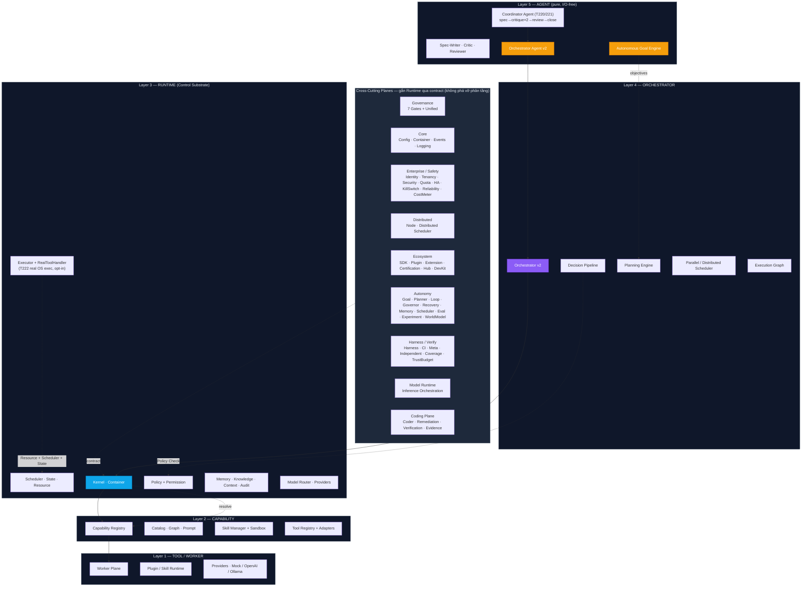
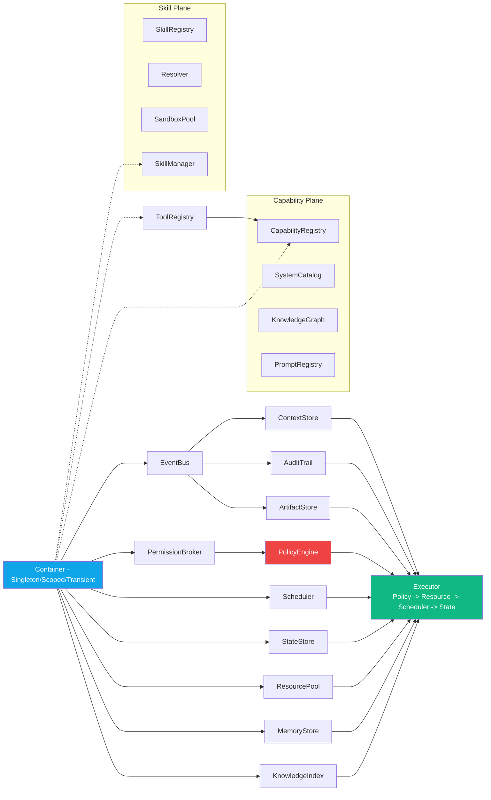
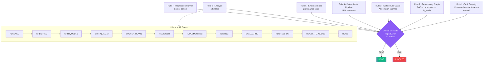
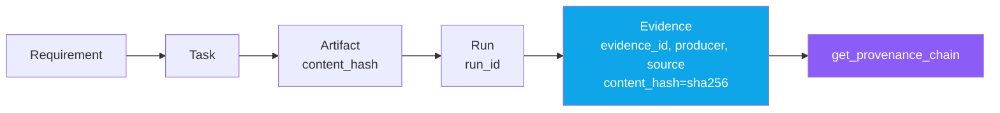
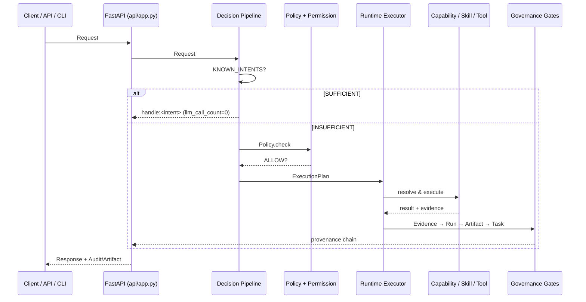
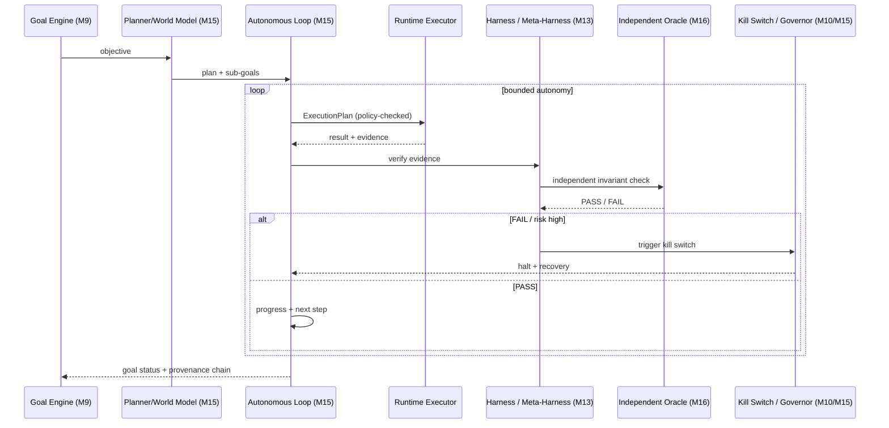

# AIOS — System Architecture Diagrams

> **Runtime-First · Plugin-First · Offline-First · Harness-Verified · Coding-Plane**
>
> Tài liệu này tổng hợp sơ đồ hệ thống AIOS từ `docs/PLAN.md`, `AGENTS.md`,
> `aios/runtime/kernel.py` và `aios/progress/PLAN.md`. Các sơ đồ dùng Mermaid —
> xem trực tiếp trên GitHub hoặc VS Code (cần extension Mermaid).

---

## 0. Tổng quan Big Picture (End-to-End)

Một request đi từ Client → API/CLI → Decision Pipeline (deterministic-first) →
Runtime Executor → Capability/Skill/Tool, đồng thời được giám sát bởi Governance
(7 gates) và sinh Evidence có provenance.



---

## 1. Phân tầng kiến trúc (Enforced Layering — ARCH-001..004)

Quy tắc import **chỉ đi xuống**, cấm vượt tầng. Guard tại
`aios/governance/architecture/guard.py`. **Trạng thái hiện tại (2026-08-25):**
**M0–M26 + TASK-220→224 đã DONE** — toàn bộ `TASK-001 → TASK-218` + `TASK-219` đều `DONE`
(3138 tests, roadmap M0–M26 + T220–224 CLOSED). Xem §8.

`Agent → Orchestrator → Runtime → Capability → Tool`

| Rule | Cấm (đối với Agent) |
|------|---------------------|
| ARCH-001 | `subprocess`, `os` execution primitives |
| ARCH-002 | provider adapters (`aios.core.providers`, `aios.runtime.providers`, …) |
| ARCH-003 | filesystem adapters (`aios.runtime.filesystem`, `filesystem`, …) |
| ARCH-004 | upward / skip-layer import (vd: `tool` → `runtime`) |



**Các plane ngang (cross-cutting) hiện có trong `aios/`** — gắn vào Runtime
qua contract, không phá vỡ phân tầng:

| Plane | Packages hiện tại |
|-------|-------------------|
| Governance | `governance/` (7 gates + unified) |
| Core | `core/` (config, container, events, logging, metadata, healthcheck, version, contracts, planner) |
| Agent / Orchestrator | `agents/`, `orchestrator/` |
| Runtime | `runtime/` (kernel, context, audit, artifact, permission, policy, execution, scheduler, state, resource, memory, knowledge, providers, workflow) |
| Capability / Tool / Worker | `capability/`, `tool/`, `skill/`, `worker/` |
| API / UX | `api/`, `dashboard/`, `cli/`, `extension/` |
| Enterprise / Safety | `identity/`, `tenancy/`, `security/`, `quota/`, `ha/`, `operations/`, `kill_switch/`, `reliability/`, `cost_meter/`, `autonomy_safety/` |
| Distributed | `distributed/`, `distributed_scheduler/` |
| Ecosystem | `sdk/`, `plugin_runtime/`, `extension_contracts/`, `ecosystem_registry/`, `ecosystem_hub/`, `devkit/`, `certification/` |
| Autonomy | `autonomous_goal/`, `autonomous_planner/`, `autonomous_loop/`, `autonomy_governor/`, `autonomous_recovery/`, `autonomous_memory/`, `autonomous_scheduler/`, `autonomous_evaluation/`, `autonomous_experimentation/`, `multi_agent_autonomy/`, `goal_durability/`, `world_model/`, `stuck_detection/`, `model_router/`, `memory_coordinator/`, `context_optimizer/` |
| Intelligence | `planning_engine/`, `execution_graph/`, `parallel_scheduler/` |
| Durable | `durable/` |
| Contracts (shared) | `contracts/` |
| Harness / Verify | `harness/`, `ci/`, `meta_harness/`, `harness_coverage/`, `independent_harness/`, `autonomous_harness_loop/`, `readiness_trust/`, `trust_budget/` |
| Model Runtime | `model_runtime/` |
| Coding Plane | `coder/`, `coding_edition/` (AIOS 2.0 — T197–218) |
| Practical Loop | `agents/coordinator.py` (T220/221) · `runtime/process.py` (T222) · `.github/skills/aios-plan/` (T223/224) |
| Remediation | `remediation_detect/`, `remediation_candidate/`, `remediation_simulation/`, `remediation_apply/`, `remediation_integrity/` |
| Verification / Evidence | `verification_integrity/`, `visual_evidence/`, `replay/`, `failure_corpus/` |
| Compatibility | `backward_compat/`, `migration/`, `versioning/`, `conformance/` |
| Behavioral / Conformance | `behavioral/` |
| Context | `context/` |
| Autonomy extras | `autonomy_constitution/` |
| Misc / Assets | `plugins/`, `skill_distiller/`, `asset_pipeline/`, `creative_domain/`, `compat_docs/`, `behavioral_docs/` |
| Upgrade / Observability | `upgrade/`, `observability/` |
| Progress (tracking) | `progress/` |

---

> **M10 cross-cutting planes (mới sau M9):** `durable/` (Durable Execution 1.0 — T066), `autonomy_safety/` (Bounded Autonomy — T067), `kill_switch/` (Emergency Stop — T068), `reliability/` (SLO/Reliability — T069), `security/` (Security Baseline 1.0 — T070), `cost_meter/` (Perf/Cost — T075) gắn vào Runtime qua contract, **không** phá vỡ phân tầng `Agent → Orchestrator → Runtime → Capability → Tool`. `contracts/` là shared contract package; `progress/` là task-tracking.

## 2. Runtime Kernel — Composition Root (`aios/runtime/kernel.py`)

`RuntimeKernel` là single composition root: khởi tạo 5 service TASK-004 + 4
service TASK-005, đăng ký vào `Container` để các tầng trên resolve theo type
mà không tight-coupling.



**Wiring order:** `EventBus → Context/Audit/Artifact/Permission → Policy(broker)
→ Scheduler/State/Resource/Memory/Knowledge → Executor`

---

## 3. Governance — 7 Gates → Unified Task Gate

`aios/governance/gates/unified.py`: `UnifiedTaskGate` là logical AND của tất cả
gate; bất kỳ exception → `FAIL` (fail-closed). `DONE` chỉ khi `PASS`.



**Workflow chuẩn (Definition of Done):**
`PLAN → SPEC → CRITIQUE×2 → BREAKDOWN → REVIEW → IMPLEMENT → TEST → EVALUATE
→ REGRESSION → PROGRESS/LOG → COMMIT`

> **Quy tắc 8 — Auto-COMMIT:** mọi TASK đã lên lịch trong
> `docs/AIOS_Master_Task_Specification_M0-M26.md` khi đạt `DONE` (Unified Gate
> `PASS`) phải `COMMIT` source **ngay trong cùng phiên**. Commit message:
> `TASK-xxx: <title> — DONE`.

**Lifecycle artifacts** (`STATE_ARTIFACTS`):

| State | Artifact |
|-------|----------|
| SPECIFIED | `spec.md` |
| CRITIQUED_1 | `critique-1.md` |
| CRITIQUED_2 | `critique-2.md` |
| BROKEN_DOWN | `tasks.md` |
| REVIEWED | `review.md` |
| IMPLEMENTING | `implementation/` |
| TESTING | `test.md` |
| EVALUATING | `evaluation.md` |
| REGRESSION | `regression.md` |

---

## 4. Deterministic-First Execution Pipeline (Rule 4)

`Request → Normalizer → RuleEngine(SUFFICIENT|INSUFFICIENT) → WorkflowMatcher
→ CapabilityResolver → Policy.check → ExecutionPlan`


LLM **không** là default control plane — chỉ fallback khi deterministic
`INSUFFICIENT`, output phải qua `validator(raw)`.

---

## 5. Evidence & Provenance Chain (Rule 5)

`Evidence → Run → Artifact → Task → Requirement`. `UNKNOWN` không được nâng
thành `PASS`.



`Evidence` yêu cầu: `evidence_id, task_id, run_id, producer, type, source,
content_hash=sha256(content)`. `EvidenceStore` giữ 5 registries.

---

## 6. Luồng thực thi End-to-End (API + Deterministic + Governance)



---

## 7. Cấu trúc Monorepo (thực tế — 2026-08-25)

```
aios/
  core/                config, container, events, logging, metadata,
                       healthcheck, version, contracts, planner
  governance/          task_registry/ dependency/ architecture/
                       deterministic/ evidence/ lifecycle/ regression/
                       gates/ cli/
  runtime/             kernel, context, audit, artifact, permission, process (T222 real exec),
                       policy, execution, scheduler, state, resource,
                       memory, knowledge, providers/, workflow/
  orchestrator/        decision_pipeline, planner, normalizer, rule_engine,
                       workflow_matcher, execution_plan, goal_manager,
                       task_queue, failure_recovery, permission_broker
  capability/          capability, catalog, graph, prompt
  skill/               manager, registry, resolver, sandbox
  tool/                adapters, registry, contracts
  worker/              contract, execution, lifecycle, registry, router, workers
  agents/              orchestrator, spec_writer, critic, reviewer, coordinator (T220/221)
  api/                 app, auth, contracts, deps, errors, events,
                       schemas, websocket, routers/
  cli/                 workflow_cli.py (entry: aiagent)
  dashboard/           client, health, mock_backend, server, views, websocket_client
  extension/           VS Code extension host
  contracts/           shared contract package (cross-package)
  autonomous_goal/     engine, contracts
  autonomous_planner/  planner, validation, contracts
  autonomous_loop/     loop, contracts
  autonomy_governor/   governor, contracts
  autonomous_recovery/ recovery, circuit, contracts
  autonomous_memory/   controller, retention, contracts
  autonomous_scheduler/ scheduler, contracts
  autonomous_evaluation/ evaluator, contracts
  autonomous_experimentation/ controller, contracts
  multi_agent_autonomy/ (M9)  goal_durability/ (T056)  world_model/ (T052)
  stuck_detection/     (T061)
  model_router/        contracts
  memory_coordinator/  contracts
  context_optimizer/   compressor, optimizer, contracts
  planning_engine/     contracts
  execution_graph/     compiler, contracts
  parallel_scheduler/  contracts, scheduler
  distributed/         node_manager, contracts
  distributed_scheduler/ scheduler, contracts
  identity/            (T035)  tenancy/ (T036)  security/ (T070)
  quota/               (T039)  ha/ (T041)  operations/ (T042)
  kill_switch/         (T068)  reliability/ (T069)  cost_meter/ (T075)
  autonomy_safety/     boundary, contracts (T067)
  durable/             (T066)
  sdk/                 (T043)  plugin_runtime/ (T044)  extension_contracts/ (T045)
  ecosystem_registry/  (T046)  ecosystem_hub/ (T048)  devkit/ (T047)
  certification/       certifier, contracts (T049)
  harness/             (T029+)  ci/ checker, cli
  meta_harness/        (T091)  verify-the-verifier
  harness_coverage/    (T090)  readiness / coverage
  independent_harness/  (T104)  integration foundation
  autonomous_harness_loop/ (T099) harness loop
  readiness_trust/     (T092)  system readiness vs harness trust
  trust_budget/        (T102)  autonomy levels + SAFE-STOP
  model_runtime/       (T112)  inference runtime orchestration
  coder/               (T125-T127) coder agent + coding planner + generation runtime
  coding_edition/      (T197-T218) AIOS 2.0 Unified Coding Plane (contract/state/policy/risk/regression)
  remediation_detect/  (T094)  detect + diagnose
  remediation_candidate/ (T095) candidate + risk scoring
  remediation_simulation/ (T096) simulation + meta-verify
  remediation_apply/   (T097)  permission + apply + rollback
  remediation_integrity/ (T098) integrity + kill switch
  verification_integrity/ (T078) fail-closed gate
  visual_evidence/     (T080)  visual regression + UI state contract
  replay/              (T079)  render replay / deterministic harness
  failure_corpus/      (T100)  failure-corpus improvement engine
  backward_compat/     (T086)  backward compatibility
  migration/           (T085)  migration 1.0->1.1
  versioning/          (T084)  version + compat baseline
  conformance/         (T087)  compatibility conformance
  behavioral/          (T089)  behavioral conformance
  context/             context retrieval / builder (T121-T124)
  autonomy_constitution/ (T103) constitution + audit trail
  plugins/             plugin packages
  skill_distiller/     (T083)  skill distiller + static deploy
  asset_pipeline/      (T081)  asset pipeline + registry
  creative_domain/     (T082)  creative domain + vendor integrity
  compat_docs/         compatibility docs
  behavioral_docs/     behavioral docs
  upgrade/             (T020)  observability/ (T021)
  progress/            PLAN.md LOG.md STATS.md tasks/<TASK-xxx>/ _TEMPLATE/
  # Practical AIOS Loop (T220-T224): agents/coordinator.py, runtime/process.py,
  #   .github/skills/aios-plan/ (Planner Agent), work/YYYYMMDD-slug/ plan convention
configs/               default.yaml development.yaml test.yaml
docs/                  PLAN.md AGENTS.md AIOS_Master_Task_Specification_M0-M26.md detailtask/
```

---

## 8. Trạng thái Task (từ `aios/progress/PLAN.md` — 2026-08-25)

**M0–M26 + TASK-220→224 đã hoàn tất (TASK-001 → TASK-219 + TASK-220 → TASK-224 đều DONE, 3138 tests). Roadmap M0–M26 + T220–224 CLOSED.**

| Milestone | Chủ đề | Task range | Status |
|-----------|--------|-----------|--------|
| M0 | Task Governance System | TASK-001 | DONE |
| M1 | Monorepo + Runtime foundations | TASK-002 → 009, 011 | DONE |
| M2 | Orchestration + workers + tools | TASK-010, 012 → 016 | DONE |
| M3 | API + Dashboard + Extension | TASK-017 → 019 | DONE |
| M4 | Upgrade / Observability / Orchestrator v2 | TASK-020 → 022 | DONE |
| M5 | Memory, context, model, planning, execution | TASK-023 → 028 | DONE |
| M6 | Harness Kernel + Verification + Benchmark | TASK-029 → 034 | DONE |
| M7 | Identity, Tenancy, Distributed, HA, Enterprise | TASK-035 → 042 | DONE |
| M8 | SDK, Plugin, Ecosystem, DevKit, Certification | TASK-043 → 049 | DONE |
| M9 | Autonomous Goal Engine | TASK-050 | DONE |
| M10 | AIOS 1.0 Baseline (Arch/Contract/Durable/Safety/KillSwitch/Reliability/Security/DevX/Dashboard/Cert/Upgrade/Perf) | TASK-063 → 075 | DONE |
| M11 | Verification Integrity + Creative (Visual/Asset/Skill) | TASK-076 → 083, 219 | DONE |
| M12 | Compatibility 1.1 (Version/Migration/Backward/Conformance/Docs) | TASK-084 → 088 | DONE |
| M13 | Behavioral Conformance + Meta-Harness | TASK-089 → 093 | DONE |
| M14 | Diagnose / Simulate / Autonomous Harness | TASK-094 → 098 | DONE |
| M15 | Autonomous Harness Loop | TASK-099 → 103 | DONE |
| M16 | Independent Harness + Verification Oracle | TASK-104 → 108 | DONE |
| M17 | Model Contracts + Provider Lifecycle | TASK-109 → 116 | DONE |
| M18 | Repo Intelligence (Scanner/Symbol/Dep/Index/Context) | TASK-117 → 124 | DONE |
| M19 | Coder Agent (Contract/Planner/Generation runtime) | TASK-125 → 134 | DONE |
| M20 | Execution + Sandbox (M20 Coding Plane) | TASK-135 → 144 | DONE |
| M21 | Coding Loop (SM + Observation + Repair) | TASK-145 → 154 | DONE |
| M22 | Evidence Adequacy (Req→Evidence + Verifiers) | TASK-155 → 164 | DONE |
| M23 | Adversarial Eval (Evidence/Test/Scope Attackers) | TASK-165 → 174 | DONE |
| M24 | Quality Gate + Risk + Governance Ledger | TASK-175 → 184 | DONE |
| M25 | Coding Evaluation Engine + Benchmarks | TASK-185 → 196 | DONE |
| M26 | Unified Coding Plane (Final Milestone) | TASK-197 → 218 | DONE |
| — | Coordinator Agent (control-plane + chat endpoint) | TASK-220, TASK-221 | DONE |
| — | AIOS Real Executor + `aiagent execute` CLI | TASK-222 | DONE |
| — | AIOS Planner Agent + Skill (request→plan.yaml) | TASK-223 | DONE |
| — | Planner confirm flow + `work/` directory convention | TASK-224 | DONE |

> **Fail-closed (audit 2026-08-22) — CLOSED:** các gap M5–M9 (T021, T023–T050, …) đã được implement trong session 2026-08-22, mỗi package đạt AC đầy đủ trong `docs/detailtask/`. Full suite: **3138 passed** (2026-08-25). Xem `aios/progress/PLAN.md`.

> **Roadmap M0–M26 + T220–224 CLOSED (2026-08-25):** toàn bộ 218 tasks + TASK-219 + TASK-220 → TASK-224 `DONE`. Không còn milestone PLANNED.

---

## 9. CLI & Lệnh chính

```bash
python -m pytest aios -q                          # all gates
python -m pytest aios/governance/architecture -q  # architecture gate only
python aios/governance/cli/gate_check.py --task TASK-001
python aios/governance/cli/parse_spec.py          # registry + dependency validation
aiagent validate  |  aiagent simulate            # workflow CLI (aios/cli/workflow_cli.py)
```

> **Thực thi thật (T220–T224):** `aiagent execute <plan.yaml> --work-dir <dir> --yes` (Real Executor, opt-in `AIOS_REAL_EXECUTION_ENABLED`); `aiagent task <TASK-id>` chạy full pipeline + 7 governance gates.

---

## 10. Lộ trình tương lai — Roadmap M10 → M26

Sau M9 (Autonomous Goal), AIOS tiến tới **AIOS 1.0** (M10–M13: đóng băng
architecture/contract, hardening, durable execution, autonomy safety, security
baseline, devX, dashboard 1.0, certification suite) rồi mở rộng sang **Coding
Plane** (M14–M26: verify-the-verifier, autonomous harness, autonomous coding
agents, evidence/risk/quality gates).


> **M0 → M26 + T220–224 đã DONE** (TASK-001 → TASK-219 + TASK-220 → TASK-224; 3138 tests). Roadmap M0–M26 + T220–224 CLOSED (2026-08-25) — không còn milestone PLANNED.

**Bản đồ milestone → chủ đề:**

| Milestone | Chủ đề chính | Task tiêu biểu | Status |
|-----------|--------------|----------------|--------|
| M9 | Autonomous Goal Engine (Planner/World/Loop/Gov/Recovery/Memory/Exp/Multi-Agent/Eval/Stuck/Scheduler) | T050 → 062 | DONE |
| M10 | AIOS 1.0 Baseline | T063 → 075 | DONE |
| M11 | Verification Integrity + Creative | T076 → 083, T219 | DONE |
| M12 | Compatibility 1.1 | T084 → 088 | DONE |
| M13 | Behavioral Conformance + Meta-Harness | T089 → 093 | DONE |
| M14 | Diagnose / Simulate / Autonomous Harness | T094 → 098 | DONE |
| M15 | Autonomous Harness Loop | T099 → 103 | DONE |
| M16 | Independent Harness + Oracle | T104 → 108 | DONE |
| M17 | Model Contracts + Provider Lifecycle | T109 → 116 | DONE |
| M18 | Repo Intelligence | T117 → 124 | DONE |
| M19 | Coder Agent | T125 → 134 | DONE |
| M20 | Execution + Sandbox | T135 → 144 | DONE |
| M21 | Coding Loop | T145 → 154 | DONE |
| M22 | Evidence Adequacy | T155 → 164 | DONE |
| M23 | Adversarial | T165 → 174 | DONE |
| M24 | Quality + Risk | T175 → 184 | DONE |
| M25 | Coding Evaluation | T185 → 196 | DONE |
| M26 | Unified Coding Plane | T197 → 218 | DONE |
| T220–224 | Practical AIOS Loop (Coordinator / Real Executor / Planner) | T220 → 224 | DONE |

---

## 11. Kiến trúc mục tiêu — AIOS 1.0 + Coding Plane

```mermaid
flowchart TB
    subgraph EXT["External Surfaces"]
        UX[Dashboard 1.0 / VS Code Ext / Public SDK]
        API[FastAPI REST + WebSocket]
    end
    subgraph GOV["Governance (fail-closed)"]
        UG[Unified Task Gate<br/>7 rules AND]
        HAR[Harness / Meta-Harness<br/>Verify-the-Verifier]
        ORACLE[Independent Verification Oracle<br/>M16]
    end
    subgraph AUTO["Autonomy Plane (M15)"]
        AG[Autonomous Goal Engine]
        PL[Planner + World Model]
        GOV2[Autonomy Governor + Kill Switch]
        LOOP[Autonomous Loop + Recovery]
    end
    subgraph CORE["Core Control Substrate"]
        ORC[Orchestrator v2 + Scheduler + Execution Graph]
        RT[Runtime Kernel + Policy + Permission]
        CAP[Capability / Skill / Tool / Worker]
    end
    subgraph CODE["Coding Plane (M19–M26)"]
        CA[Coder Agent Contract + SM]
        CP[Coding Planner + PlanVerifier]
        CL[Coding Loop SM + Observation]
        CE[Coding Eval + Unified Contract + Policy]
    end
    subgraph ENT["Enterprise / Distributed"]
        ID[Identity/RBAC + Tenancy]
        DIST[Distributed Runtime + Scheduler]
        HA[HA + Audit + Recovery]
        QUOTA[Quota + Cost]
    end
    subgraph ECO["Ecosystem"]
        SDK[Public SDK] REG[Ecosystem Registry] HUB[Ecosystem Hub] CERT[Certification]
    end

    subgraph PRAC["Practical AIOS Loop (T220–T224)"]
        CO[Coordinator Agent<br/>spec→critique×2→review→close]
        PLN[Planner Agent<br/>request→plan.yaml]
        REX[Real Executor<br/>aiagent execute (opt-in)]
    end

    UX --> API --> ORC
    ORC --> RT --> CAP
    PLN -.->|plan.yaml| REX
    CO -.->|coordinate| ORC
    REX -.->|real OS exec| RT
    AG --> PL --> LOOP --> GOV2
    GOV2 -.->|bounded autonomy| ORC
    CA --> CP --> CL --> CE
    CE -.->|evidence| HAR
    HAR --> UG --> ORACLE
    RT -.-> ENT
    CAP -.-> ECO

    style UG fill:#8b5cf6,color:#fff
    style ORACLE fill:#8b5cf6,color:#fff
    style HAR fill:#0ea5e9,color:#fff
    style GOV2 fill:#ef4444,color:#fff
    style RT fill:#10b981,color:#fff
    style CO fill:#f59e0b,color:#fff
    style PLN fill:#0ea5e9,color:#fff
    style REX fill:#10b981,color:#fff
```

---

## 12. Vòng lặp Tự chủ & Verification Oracle (M15–M16)



---

## 13. Khoảng cách đã biết — CLOSED (audit 2026-08-22)

Các gap M5–M9 dưới đây đã được **implement** trong session 2026-08-22, đưa mỗi
`aios/<package>/` đạt AC đầy đủ trong `docs/detailtask/` (xem
`aios/progress/PLAN.md` — “Known implementation gaps — CLOSED”). Nguyên tắc
**fail-closed** vẫn giữ: UNKNOWN ≠ PASS; spec luôn là canonical target.

| Task | Gap chính |
|------|-----------|
| T021 Observability | thiếu Health API / Dashboard-integration chuyên biệt |
| T023 Memory Coordinator | thiếu `filters`/`ranking_policy`/`provenance`/`checksum` |
| T024 Context Optimizer | gộp sub-component, non-ASCII id `P5参考资料` |
| T025 Model Router | thiếu `FallbackResolver`/fallback chain |
| T028 Parallel Scheduler | `JoinPolicy` chỉ `ALL_SUCCESS` |
| T029–T034 Harness | thiếu Registry/Replay/Evaluators/Doctor modules + CLI |
| T035–T042 Enterprise | thiếu ABAC/Tenant boundary/HA audit/Operations endpoints |
| T043–T050 Ecosystem | thiếu TS SDK/Plugin isolation/Cert profiles/Goal SM |

> Nguyên tắc **fail-closed**: UNKNOWN không được nâng thành PASS; spec luôn là
> canonical target. Các gap này đã được lấp trong M10 (hardening, durable,
> safety, security, reliability) — full suite hiện tại **3138 passed** (2026-08-25, M0–M26 + T220–224 CLOSED).

---

## 14. Các Flow Thực thi Đã Demo (verified 2026-08-25)

Dưới đây là các luồng thực tế đã được kích hoạt và xác nhận chạy thành công
(offline, không cần LLM/API) qua `aiagent execute` / `aiagent task`. Mỗi flow
tương ứng một entry-point trong sơ đồ ở trên.

### 14.1 Tổng hợp các flow (vắn tắt)

```mermaid
flowchart TB
    subgraph F1["Flow A — Governance Pipeline (aiagent task)"]
        A1[Coordinator Agent<br/>spec→critique×2→review→orchestrate] --> A2[7 Governance Gates<br/>Unified PASS]
    end
    subgraph F2["Flow B — Real Executor (aiagent execute)"]
        B1[plan.yaml] --> B2[RuntimeKernel + RealToolHandler<br/>subprocess, permission-checked]
    end
    subgraph F3["Flow C — Architecture Guard"]
        C1[pytest aios/governance/architecture] --> C2[AST import scanner<br/>ARCH-001..004]
    end
    subgraph F4["Flow D — Local CI Gate"]
        D1[aiagent ci check] --> D2[core-tests + deps<br/>fail-closed]
    end
    subgraph F5["Flow E — Registry + Dependency"]
        E1[parse_spec.py --spec master] --> E2[Rule 1 unique ID<br/>Rule 2 DAG]
    end
    subgraph F6["Flow F — Harness / Verify-the-Verifier"]
        F1h[pytest aios/harness] --> F2h[Kernel/Scenario/Eval/Doctor]
    end
    subgraph F7["Flow G — Decision Pipeline (deterministic)"]
        G1[Request 'status'] --> G2[KNOWN_INTENT → SUFFICIENT<br/>0 LLM calls]
    end
    subgraph F8["Flow H — Coding Plane (optional)"]
        H1[CodingEdition + doctor] --> H2[smoke test offline<br/>viết code = cần Capability+RealExec]
    end
    subgraph F9["Flow I — Practical Planner Loop"]
        I1[Request NL] --> I2[Planner → plan-sub.yaml]
        I2 --> I3[Confirm yes]
        I3 --> I4[aiagent execute sub-plan<br/>→ artifact thật]
    end

    style A2 fill:#8b5cf6,color:#fff
    style B2 fill:#10b981,color:#fff
    style C2 fill:#0ea5e9,color:#fff
    style D2 fill:#0ea5e9,color:#fff
    style E2 fill:#0ea5e9,color:#fff
    style F2h fill:#0ea5e9,color:#fff
    style G2 fill:#10b981,color:#fff
    style H2 fill:#f59e0b,color:#fff
    style I4 fill:#10b981,color:#fff
```



### 14.2 Bảng ánh xạ Flow → Entry-point → Trạng thái

| Flow | Luồng trong sơ đồ | Entry-point đã chạy | Kết quả |
|------|-------------------|---------------------|---------|
| A | Coordinator + 7 Gates + Lifecycle | `aiagent task TASK-VERIFY-001` | ✅ PASS (gates PASS) |
| B | Real OS Execution (T222) | `aiagent execute plan.yaml` | ✅ COMPLETED |
| C | Architecture Guard (ARCH-001..004) | `pytest aios/governance/architecture` | ✅ 116 tests |
| D | Local CI (fail-closed pre-push) | `aiagent ci check --scope core` | ✅ 135/135 |
| E | Registry (R1) + Dependency (R2) | `parse_spec.py --spec master` | ✅ 224 tasks |
| F | Harness / Verify-the-Verifier | `pytest aios/harness` | ✅ 100% |
| G | Decision Pipeline (deterministic) | `DecisionPipeline.execute('status')` | ✅ SUFFICIENT, 0 LLM |
| H | Coder Agent / Coding Plane (optional) | `CodingEdition` + `doctor` | ✅ loaded (offline) |
| I | Practical Planner Loop (T220–224) | `aiagent execute plan-sub.yaml` | ✅ artifact thật |

> **Ghi chú:** Flow B (`aiagent execute` thuần) chỉ chạy shell `command:` —
> không chạy governance pipeline. Để chạy toàn bộ vòng đời có governance, dùng
> Flow A (`aiagent task`). Flow H chỉ là smoke-test; muốn AIOS **thực sự viết
> code** cần nối Capability + `RealToolHandler` (T222) rồi gọi
> `CodingEdition.run(authorization=..., generated_code=..., verification_report=...)`.

*Tài liệu được sinh tự động từ source tree AIOS — cập nhật 2026-08-25 (thêm TASK-220→224, coding_edition/, Coordinator Agent, Real Executor, Planner Loop, §14 các flow đã demo).*
